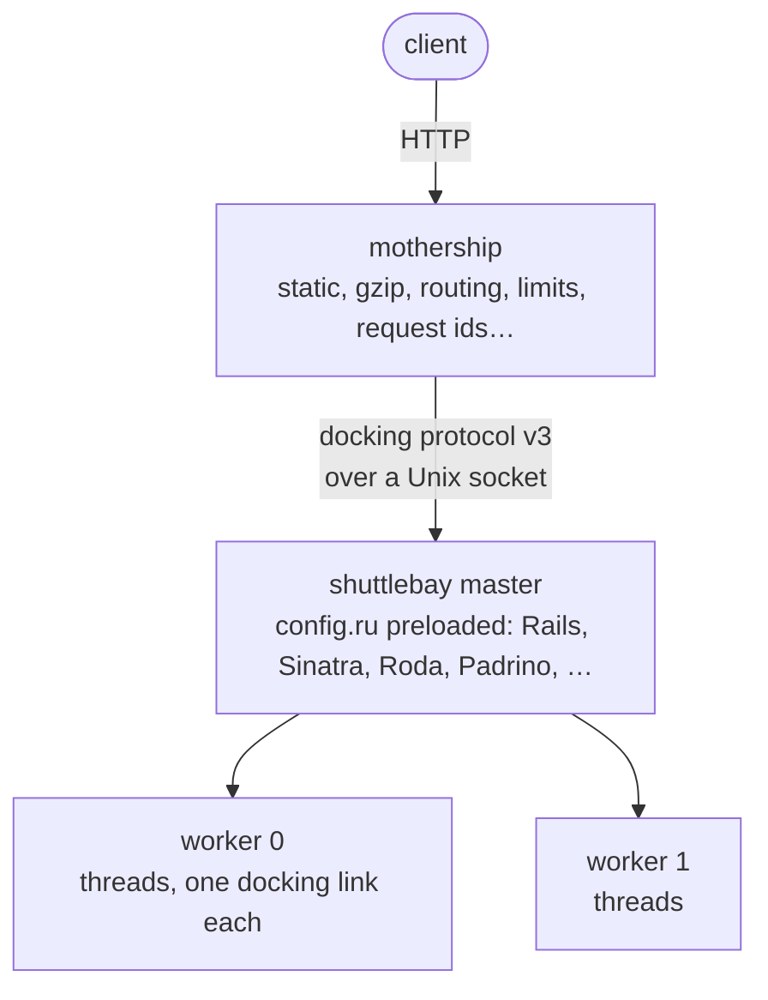

# Shuttlebay

Run a Rack app as a [Mothership](https://github.com/seuros/mothership) `[[bays.http]]` bay.

Mothership is the HTTP server. Shuttlebay is the Ruby side: it preloads your
app, forks workers, and runs the app on threads that receive requests over
Unix-socket docking links. A native engine (Rust, via magnus) decodes the
docking protocol and builds the Rack env, so Ruby never parses HTTP.



## Install

```ruby
# Gemfile
gem "shuttlebay"
gem "guardship"    # the mothership binary (or: cargo install mothership)
```

```toml
# ship-manifest.toml
[mothership.bind]
http = "0.0.0.0:3000"

[[mothership.static_dirs]]   # public/ served by mothership, not Rails
path = "./public"
prefix = "/"

[[bays.http]]
name = "web"
command = "bundle"
args = ["exec", "shuttlebay", "config.ru"]
workers = "auto"   # default: sized from CPUs and memory; 0 = single process
threads = 5
routes = [{ bind = "http", pattern = "/.*" }]
```

```bash
bundle exec mothership
```

## What Mothership does instead of Rack middleware

| Concern | Before (app server + middleware) | With Shuttlebay |
|---|---|---|
| HTTP parsing, keep-alive, slow clients | App server reactor | Mothership |
| Static files | `ActionDispatch::Static` / nginx | `[[mothership.static_dirs]]` |
| `send_file` / `Rack::Sendfile` | X-Sendfile + nginx | `to_path` bodies streamed from disk by Mothership |
| Compression | `Rack::Deflater` / nginx | `compression = true` |
| Request id, queue time | `ActionDispatch::RequestId`, LB | `X-Request-Id`, `X-Request-Start: t=<µs>` |
| Real client IP | `RemoteIp` + proxy config | `REMOTE_ADDR` resolved (Forwarded / PROXY protocol) |
| Load balancing to workers | kernel accept / `wait_for_less_busy_worker` | idle-thread checkout; queueing in Mothership |
| Request body buffering | App server | Mothership reads the whole body before claiming a thread |

When Rails is loaded, the bundled Railtie removes `Rack::Sendfile`, since the
engine offloads `to_path` bodies itself.

## Hooks

`config.ru` loads in the master before forking, so register hooks there:

```ruby
Shuttlebay.before_fork { ActiveRecord::Base.connection_pool.disconnect! }
Shuttlebay.on_worker_boot { |index| Rails.logger.info("worker #{index} up") }
Shuttlebay.on_worker_shutdown { |index| Rails.logger.info("worker #{index} drained") }
Shuttlebay.out_of_band { GC.start }   # runs when a worker has no request in flight
run Rails.application
```

## Fibers

With a fiber scheduler, each worker runs its `threads` docking links as fibers
on one reactor thread instead of as threads. A request waiting on I/O parks
its fiber, and the reactor serves the other links meanwhile.

```ruby
# config.ru (Gemfile: gem "async")
require "async"
Shuttlebay.fiber_scheduler { Async::Scheduler.new }
run Rails.application
```

The block runs once per worker, after fork, on the reactor thread; any
`Fiber::Scheduler` works. `threads` in the manifest still counts docking links
per worker, so Mothership needs no change, but a parked fiber costs no thread,
so it can go much higher (64, 256).

- Fibers are not preempted: a request burning CPU stalls every other request
  on its reactor. Size `workers` for CPU and `threads` for I/O wait.
  `Shuttlebay.fiber_scheduler(reactors: 4) { … }` splits a worker's links
  across 4 reactor threads, which Ruby does preempt, so one busy request
  stalls a quarter of the links instead of all of them.
- Only I/O through Ruby's scheduler yields: Ruby sockets (`Net::HTTP`, Redis
  clients without hiredis), `pg`, `sleep`. C extensions doing their own
  blocking I/O (`mysql2`, libcurl gems) stall the reactor.
- Rails: set `config.active_support.isolation_level = :fiber` and size the
  Active Record pool to at least `threads`.
- Hijacked connections (WebSockets) still relay on their own threads.
- Async's I/O hooks use `IO::Buffer`, so Ruby prints a one-time experimental
  warning to stderr; `Warning[:experimental] = false` silences it.

## Development server and system tests

```bash
bin/rails server -u shuttlebay        # or: rackup -s shuttlebay
```

```ruby
# test/application_system_test_case.rb
require "shuttlebay/capybara"
Capybara.server = :shuttlebay
```

Both run the app in their own process and start a Mothership that attaches to
it, so development and tests go through the same HTTP stack as production. The
binary comes from `MOTHERSHIP_BIN`, the `guardship` gem, or `PATH`. The
`Threads` option (`rackup -O Threads=5`) or `MS_BAY_THREADS` sets the thread
count; Mothership sizes its link pool from what the app reports when it docks.

For HTTPS, run Mothership with a `tls` bind and the app as a docking upstream
(see the Mothership README) instead of the attached server.

## Behaviour

- **Responses:** HEAD, 1xx, 204 and 304 send no body. `to_ary` bodies go out
  in one write. `each` bodies flush per chunk (SSE, `ActionController::Live`).
  Rack 3 streaming bodies (`call`) are supported. A `to_path` body with status
  200 is served by Mothership from disk.
- **Thread handoff:** after the response's last byte, the thread closes the
  body and runs `rack.response_finished` callbacks, then sends `Ready`.
  Mothership routes the next request to that link only after `Ready`, so a
  request never waits behind Rails' after-response work.
- **Errors:** an exception before the head goes out becomes a 500. After the
  head, the link is closed and the response aborts.
  `rack.response_finished` callbacks run after every response.
- **WebSockets:** run ActionCable on [orbitcast](https://github.com/seuros/orbitcast),
  which holds the sockets in Rust and speaks ActionCable's protocol, so no
  Ruby thread sits on a connection. Every other WebSocket (Faye,
  `websocket-driver`, custom protocols, or ActionCable's built-in server in
  development and system tests) goes through `rack.hijack`: the app answers on
  the hijacked IO, Mothership relays the upgraded connection, and the thread
  goes back to serving while the relay runs on threads of its own.
- **Early hints:** not offered (`rack.early_hints` is absent). Mothership's
  HTTP stack cannot send 1xx responses yet; Rails falls back to `Link`
  headers on the final response.
- **Large uploads:** bodies over 1 MiB are spooled to an unlinked temp file
  (`rack.input` is a `Tempfile`). Memory stays bounded however large uploads
  are allowed to be.
- **Signals:** on `TERM`, workers stop accepting, drop idle links, and finish
  in-flight requests within `MS_BAY_DRAIN_TIMEOUT` (Mothership passes the
  bay's `request_timeout`). A dead worker is re-forked with backoff.
- **Deploys:** `kill -USR1` the mothership process to roll the bay to new code
  with no dropped requests (phased restart).
- **TLS:** terminated by Mothership on a `tls` bind; the app sees
  `rack.url_scheme = "https"`.
- **Logs:** JSON lines on stdout, which Mothership passes through.

## Environment (set by Mothership)

`MS_SOCKET_PATH`, `MS_SHIP`, `MS_BAY_WORKERS`, `MS_BAY_THREADS`, `MS_BAY_DRAIN_TIMEOUT`.

## Development

```bash
bundle install
bundle exec rake compile   # builds lib/shuttlebay/shuttlebay.{bundle,so}
bundle exec rake test
```

The engine crate (`ext/shuttlebay`) shares the wire format with Mothership
through `mothership-docking-protocol` and is never published to crates.io.
Platform gems: `bundle exec rake platforms:build` (rb-sys-dock, Docker).

Releases: release-please tags the version, CI builds the platform and source
gems and attaches them to the GitHub release. Push them to rubygems.org from a
workstation:

```bash
bundle exec rake 'gems:fetch[v0.1.0]'   # download the release's gems into pkg/
bundle exec rake 'gems:push[v0.1.0]'    # fetch, then gem push each one
```

## License

MIT
